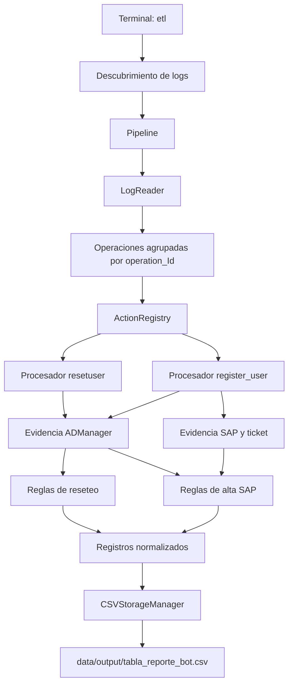

# Arquitectura

El proyecto utiliza un ETL por lotes. ETL significa **extraer, transformar y
cargar**: lee eventos de los logs, los convierte a filas con un esquema común y
guarda solamente filas que todavía no existen.

## Responsabilidades

La arquitectura separa las decisiones que cambian por razones distintas:

- La CLI conoce argumentos y códigos de salida, pero no interpreta logs.
- El descubrimiento conoce nombres y fechas de archivos, pero no acciones.
- El lector agrupa líneas, pero no decide qué significan.
- El registro selecciona un procesador según el endpoint.
- Cada procesador construye un registro para una acción concreta.
- Los módulos de evidencia extraen hechos observables.
- Los módulos de resultados aplican reglas de negocio sobre esos hechos.
- El almacenamiento valida, deduplica y escribe, sin conocer ADManager o SAP.

Esta separación evita que una nueva acción obligue a modificar todo el proceso.
Para agregar otro endpoint se crea un procesador y se registra; el lector, el
pipeline y el almacenamiento continúan funcionando con el mismo contrato.

## Contrato común de salida

Ambos procesadores producen diccionarios con las columnas definidas en
`src/etl/config.py`: identificador, fecha, solicitante, objetivo, acción,
sistema, nombres, oficinas, resultado y fecha de carga. El almacenamiento elimina
cualquier columna fuera de ese esquema antes de escribir.
